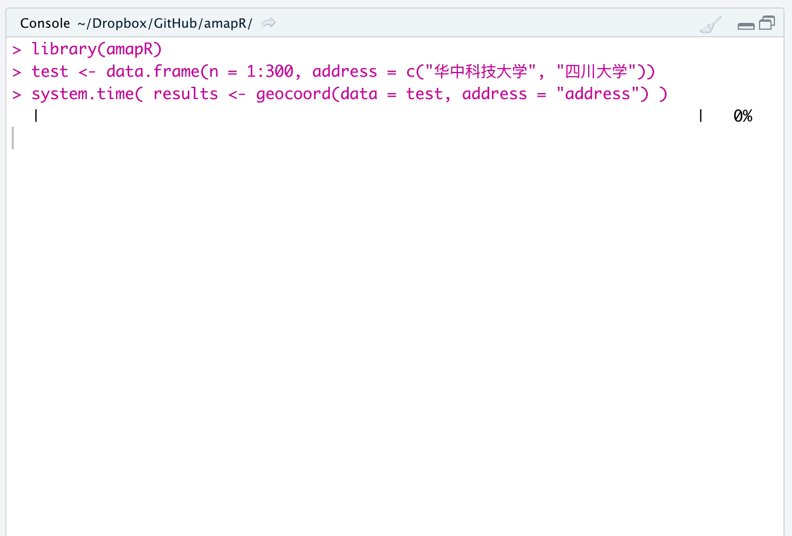
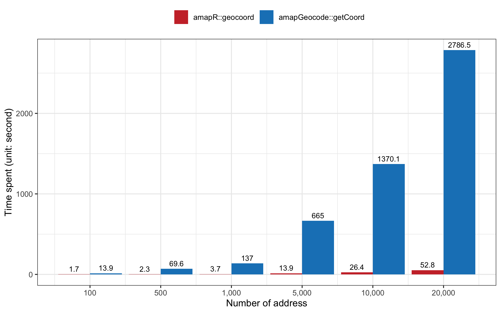

# amapR
An R package using AMap Web Service API to convert between addresses and coordinates.

## Package features

- **Parallel computing**
  
  Benefiting from the R parallel computing, `amapR` package has speed advantage in handling large data of addresses or coordinates. Under the premise of not exceeding the query limit, the more CPU cores you use, the faster the functions in this package will be.

- **Batch query**

   This package embed the batch query feature of AMap Web Service API, which allows us to query a batch of addresses or coordinates in one time. For example, AMap API can convert 10 addresses into coordinates in one query. The upper query limit for personal certified developer is 3 millions per day. That is, a personal certified developer, theoratically, can convert <u>30 million</u> addresses per day.

- **Handle special characteristics or missing value**

  This package could handle the addresses or coordinates with special characteristics or missing value by "skipping" them and returning empty results.

- **Progress bar**
  
  This package provides a progress bar to show the query progress, which is very useful when the query time may be unpredictable.
  
- **Breif report**
  
  A berif report including the success and failure rates is shown at the end of query.

## Installation

```R
devtools::install_github("xiaojunlin/amapR") 
```

**NOTE:** Before using the package, please make sure that you have applied the AMap Web Service API key from the [official website](https://lbs.amap.com/api/webservice/guide/create-project/get-key). Here is the [manual](docs/amapR_0.2.1.pdf) for this package.

## geocoord

```R
library(amapR)
options(amap.key = 'xxxxxxxx')
```

Use the `geocoord` function to convert addresses into coordinates. 




- When the number of addresses is less than or equal to 200, `geocoord` only utilizes one processor, which makes it single-threaded.

>200 addresses

```R
test <- data.frame(n = 1:200, address = c("华中科技大学", "四川大学"))
system.time( result <- geocoord(data = test, address = "address") )
```
```R
|::::::::::::::::::::::::::::::::::::::::::::::::::::::::::::::::::::::| 100%
Success rate:100% | Failure rate:0%  
user     system    elapsed
0.690    0.045     10.736
```
Here is the returned result in `data.table` format.

```R
result
```
```R
       n   address          formatted_address longitude latitude
  1:   1  华中科技大学 湖北省武汉市洪山区华中科技大学  114.4345 30.51105
  2:   2     四川大学     四川省成都市武侯区四川大学  104.0837 30.63087
  3:   3 华中科技大学 湖北省武汉市洪山区华中科技大学  114.4345 30.51105
  4:   4     四川大学     四川省成都市武侯区四川大学  104.0837 30.63087
  5:   5 华中科技大学 湖北省武汉市洪山区华中科技大学  114.4345 30.51105
 ---                                                                   
196: 196     四川大学     四川省成都市武侯区四川大学  104.0837 30.63087
197: 197 华中科技大学 湖北省武汉市洪山区华中科技大学  114.4345 30.51105
198: 198     四川大学     四川省成都市武侯区四川大学  104.0837 30.63087
199: 199 华中科技大学 湖北省武汉市洪山区华中科技大学  114.4345 30.51105
200: 200     四川大学     四川省成都市武侯区四川大学  104.0837 30.63087
```

- When the number of addresses is over 200, `geocoord` utilizes multiple processors and runs parallel computation. The following examples were run in the MacBook Pro (13-inch, 2016, Four Thunderbolt 3 Ports) with Intel Core i5 (2 cores and 4 threads).

>1,000 addresses

```R
test <- data.frame(n = 1:1000, address = c("华中科技大学", "四川大学"))
system.time( result <- geocoord(data = test, address = "address") )
```
```R
|::::::::::::::::::::::::::::::::::::::::::::::::::::::::::::::::::::::| 100%
Success rate:100% | Failure rate:0%
user     system    elapsed
0.142    0.057     7.475 
```

>10,000 addresses

```R
# 10,000 addresses
test <- data.frame(n = 1:10000, address = c("华中科技大学", "四川大学"))
system.time( result <- geocoord(data = test, address = "address") )
```
```R
|::::::::::::::::::::::::::::::::::::::::::::::::::::::::::::::::::::::| 100%
Success rate:100% | Failure rate:0%
user     system    elapsed
1.044    0.344     64.697   
```

- When the addresses have missing value

```R
test <- data.frame(n = 1:1000, address = c(NA, "四川大学"))
system.time( result <- geocoord(data = test, address = "address") )
```
```R
|::::::::::::::::::::::::::::::::::::::::::::::::::::::::::::::::::::::| 100%
Success rate:50% | Failure rate:50%
   user  system elapsed 
  0.170   0.066   7.901
```
```R
result
```
```R
         n  address    formatted_address longitude latitude
   1:    1     <NA>                   NA        NA       NA
   2:    2 四川大学 四川省成都市武侯区四川大学  104.0837 30.63087
   3:    3     <NA>                   NA        NA       NA
   4:    4 四川大学 四川省成都市武侯区四川大学  104.0837 30.63087
   5:    5     <NA>                   NA        NA       NA
  ---                                                            
 996:  996 四川大学 四川省成都市武侯区四川大学  104.0837 30.63087
 997:  997     <NA>                   NA        NA       NA
 998:  998 四川大学 四川省成都市武侯区四川大学  104.0837 30.63087
 999:  999     <NA>                   NA        NA       NA
1000: 1000 四川大学 四川省成都市武侯区四川大学  104.0837 30.63087
```

- We have queryed **100,000** addresses in the following two different platforms with different CPU cores to compare the speed of `geocoord` function. The results have shown that the Windows with more CPU cores is faster than the macOS (**260**s vs **629**s).

> **macOS**: 2.9GHz Intel Core i5 (2 cores and 4 threads) , 16 GB memory

```R
# 100,000 addresses
test <- data.frame(n = 1:100000, address = c("华中科技大学", "四川大学"))
system.time( result <- geocoord(data = test, address = "address") )
```
```R
|::::::::::::::::::::::::::::::::::::::::::::::::::::::::::::::::::::::| 100%
Success rate:100% | Failure rate:0%
user     system    elapsed
9.964    2.996     628.518   
```

> **Windows**: 3.6GHz Intel Core i7 (4 cores and 8 threads), 8 GB mermory

```R
# 100,000 addresses
test <- data.frame(n = 1:100000, address = c("华中科技大学", "四川大学"))
system.time( result <- geocoord(data = test, address = "address") )
```
```R
|::::::::::::::::::::::::::::::::::::::::::::::::::::::::::::::::::::::| 100%
Success rate:100% | Failure rate:0%
user     system    elapsed
4.93     0.58      260.27   
```
However, the Amap Web Service API have set the [query limit](https://lbs.amap.com/api/webservice/guide/tools/flowlevel) (e.g., 200 times per second for personal certified developer). For personal certified developer, I would not recommend you to use too many CPU cores. To avoid http error, you can set the specific number of CPU cores used in the `ncore` argument. `ncore` = 999 by default, which indicates the maximum of CPU cores minus 1 were used in parallel computing if your CPU is less than 999 cores. For example:

> 2 CPU cores

```R
test <- data.frame(n = 1:3000, address = c("华中科技大学", "四川大学"))
system.time( result <- geocoord(data = test, address = "address", ncore = 2) )
```
```R
|::::::::::::::::::::::::::::::::::::::::::::::::::::::::::::::::::::::| 100%
Success rate:100% | Failure rate:0%
user     system    elapsed
0.09     0.01      28.25 
```
> 4 CPU cores
```R
test <- data.frame(n = 1:3000, address = c("华中科技大学", "四川大学"))
system.time( result <- geocoord(data = test, address = "address", ncore = 4) )
```
```R
|::::::::::::::::::::::::::::::::::::::::::::::::::::::::::::::::::::::| 100%
Success rate:100% | Failure rate:0%
user     system    elapsed
0.19     0.03      14.48 
```


### Benchmarking

[`amapGeocode`](https://cran.r-project.org/web/packages/amapGeocode/index.html) is a popular R package using AMap API to convert between addresses and coordinates. The `getCoord` function in this package could convert addresses into coordinates. To compare the speed of `amapGeocode::getCoord` and `amapR::geocode`, we had queried a series of addresses using these two functions, respectively. The results were shown below.

| Testing environment|  | 
| ------ | ------ | 
| Operation System | Windows 10 | 
| CPU | 3.6GHz Intel Core i7 (4 cores and 8 threads) |
| Memory | 8 GB  |
| R version | 4.0.5 |
| RStudio version | 1.4.1106 |
| Network| China Telecom, Chengdu|
| Date |2021-04-20 8:00PM  (GMT+8) |F





## geolocation

Convert the coordinates into formatted addresses.

Examples:

> 200 coordinates

```R
test <- data.frame(n = 1:200, lng = c(114.4345,104.0837), lat = c(30.51105, 30.63087))
system.time( results <- geolocation(data = test, longitude = "lng", latitude = "lat") )
```
```R
|::::::::::::::::::::::::::::::::::::::::::::::::::::::::::::::::::::::| 100%
Success rate:100% | Failure rate:0%
user    system  elapsed 
0.342   0.029   5.891 
```

> 10,000 coordinates

```R
test <- data.frame(n = 1:10000, lng = c(114.4345,104.0837), lat = c(30.51105, 30.63087))
system.time( results <- geolocation(data = test, longitude = "lng", latitude = "lat") )
```
```R
|::::::::::::::::::::::::::::::::::::::::::::::::::::::::::::::::::::::| 100%
Success rate:100% | Failure rate:0%
user    system  elapsed 
0.604   0.224   40.198 
```


## transcoord

Transform the coordinates from other coordinate systems to Amap system, including baidu, gps, and mapbar.

Examples:

> 200 coordinates from gps system

```R
test <- data.frame(n = 1:200, lng = c(114.4345,104.0837), lat = c(30.51105, 30.63087))
results <- transcoord(data = test, longitude = "lng", latitude = "lat", coordsys = "gps")
```
```R
|::::::::::::::::::::::::::::::::::::::::::::::::::::::::::::::::::::::| 100%
Success rate:100% | Failure rate:0%
user    system  elapsed 
0.110   0.013   2.337 
```
> 10,000 coordinates from baidu system

```R
test <- data.frame(n = 1:10000, lng = c(114.4345,104.0837), lat = c(30.51105, 30.63087))
system.time( results <- transcoord(data = test, longitude = "lng", latitude = "lat", coordsys = "baidu") )
```
```R
|::::::::::::::::::::::::::::::::::::::::::::::::::::::::::::::::::::::| 100%
Success rate:100% | Failure rate:0%
user    system  elapsed 
0.316   0.108   16.892 
```
